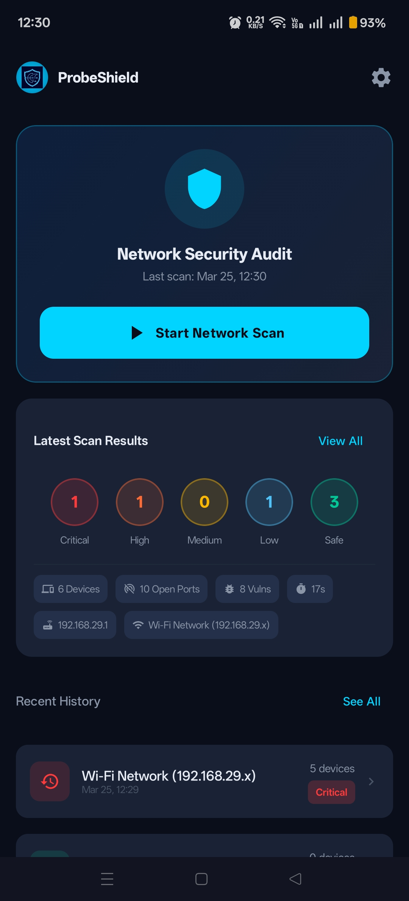
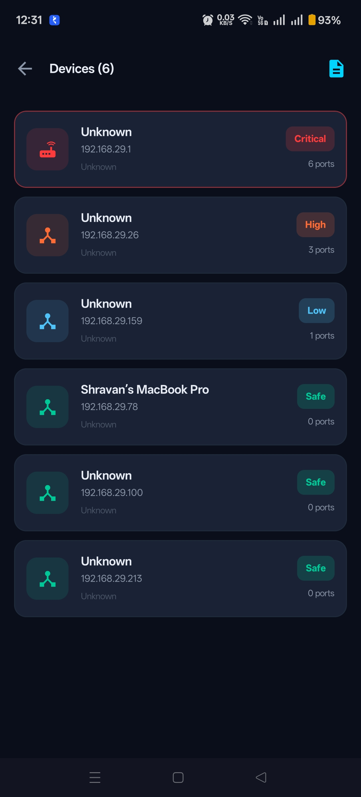
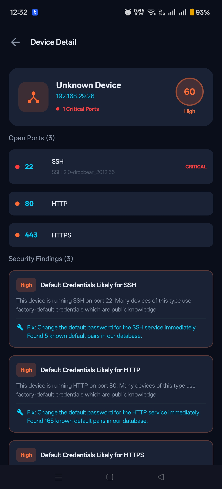
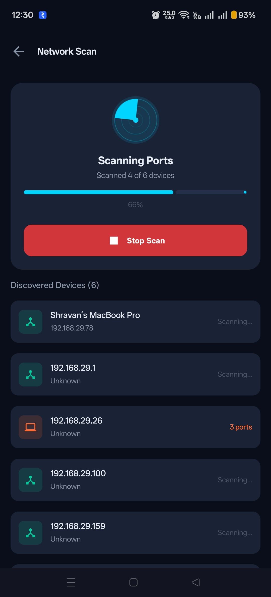
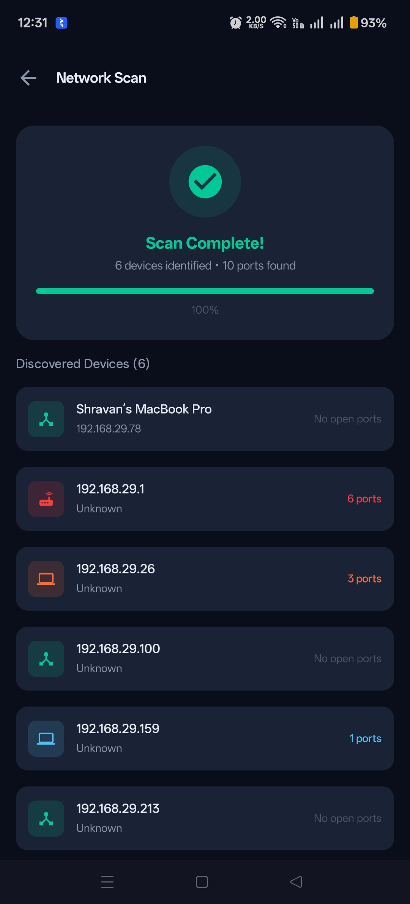
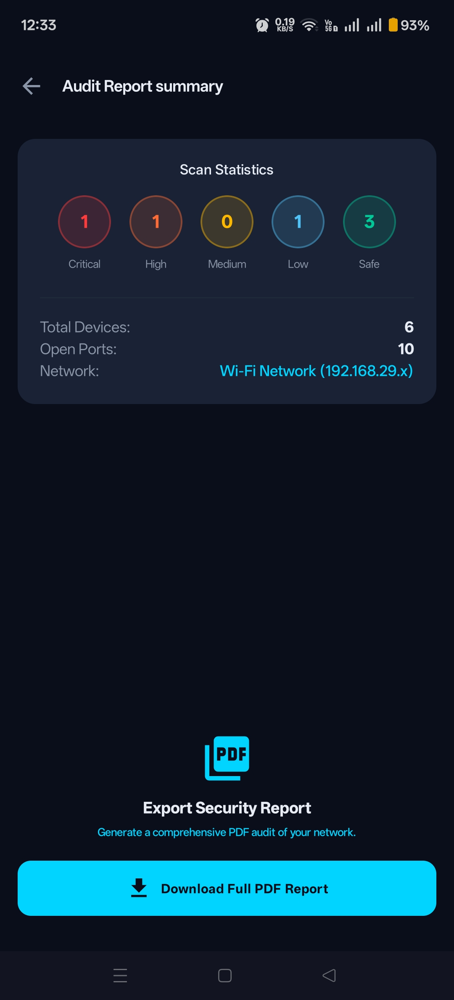
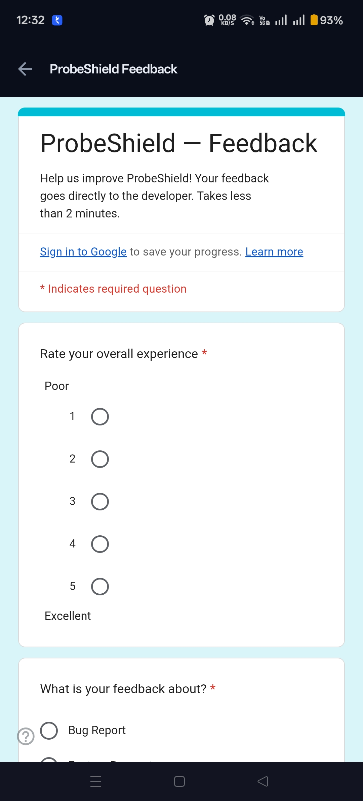

# ProbeShield — Network Security Audit

  

  <strong>Probe everything. Shield everyone.</strong> 
  A powerful network security audit tool for Android.

  
  
  

---

## What is ProbeShield?

ProbeShield scans your local WiFi network to identify connected devices, open ports, and security vulnerabilities — giving you a clear risk picture of everything on your network.

### Key Features

- 🔍 **Device Discovery** — ARP + mDNS + ping sweep
- 🔌 **Port Scanner** — Top 100 TCP ports per device
- 🏷️ **Manufacturer Lookup** — MAC OUI identification
- ⚠️ **Risk Scoring** — Critical / High / Medium / Safe ratings
- 📜 **Scan History** — All scans stored locally on your device
- 🔒 **App Lock** — PIN + biometric protection
- 🚫 **No cloud** — 100% on-device, no data ever leaves your phone

---

## Download & Install

### Step 1 — Download the APK

👉 **[Download Latest APK](https://github.com/sai1004/probeshield-releases/releases/latest)**

### Step 2 — Allow Unknown Sources

On your Android device:

1. Open **Settings**
2. Go to **Apps** → **Special app access** → **Install unknown apps**
3. Select your **browser** (Chrome, Firefox, etc.)
4. Toggle **"Allow from this source"** ON

> ℹ️ On some devices this prompt appears automatically when you tap the downloaded APK.

### Step 3 — Install

1. Open your **Downloads** folder
2. Tap `ProbeShield-v1.0.0.apk`
3. Tap **Install**
4. Tap **Open**

---

## Requirements

| Requirement     | Minimum                  |
| --------------- | ------------------------ |
| Android version | 8.0 (Oreo) / API 26      |
| Storage         | ~25 MB                   |
| Network         | WiFi connection required |
| Permissions     | See below                |

---

## Permissions Explained

ProbeShield requests the following permissions — here's exactly why each one is needed:

| Permission             | Why it's needed                               |
| ---------------------- | --------------------------------------------- |
| `ACCESS_WIFI_STATE`    | Read WiFi network info (SSID, gateway IP)     |
| `ACCESS_FINE_LOCATION` | Required by Android to scan WiFi networks     |
| `INTERNET`             | Send probe packets to devices on your network |
| `USE_BIOMETRIC`        | App lock via fingerprint                      |
| `USE_FINGERPRINT`      | App lock fallback (older devices)             |

> 🔒 **No data is ever transmitted to any server.** All scan results are stored locally on your device only.

---

## Screenshots

  
  
  
  

  
  

---

## Changelog

See [CHANGELOG.md](CHANGELOG.md) for full version history.

---

## Beta Testing

ProbeShield is currently in **closed beta**. If you'd like to participate:

1. Install the APK using the instructions above
2. Use the app on your home/office WiFi for a few days
3. Report any bugs via [Issues](https://github.com/sai1004/probeshield-releases/issues/new?template=bug_report.md)
4. Share feedback via [support@probeshield.com](mailto:support@probeshield.com)

---

## Support

| Channel             | Link                                                                    |
| ------------------- | ----------------------------------------------------------------------- |
| 📧 Email            | [support@probeshield.com](mailto:support@probeshield.com)               |
| 🌐 Website          | [probeshield.com](https://probeshield.com)                              |
| 🔒 Privacy Policy   | [probeshield.com/privacy](https://probeshield.com/privacy)              |
| 📄 Terms of Service | [probeshield.com/terms](https://probeshield.com/terms)                  |
| 🐛 Bug Reports      | [GitHub Issues](https://github.com/sai1004/probeshield-releases/issues) |

---

## Legal

ProbeShield is intended for use on networks you own or have explicit permission to scan.
Unauthorised scanning of networks is illegal in most jurisdictions.

By using ProbeShield you agree to our [Terms of Service](https://probeshield.com/terms).

---

  Made with ❤️ by <a href="mailto:sai.bsk1@gmail.com">Saikiran Bavandla</a> 
  © 2025 ProbeShield. All rights reserved.

